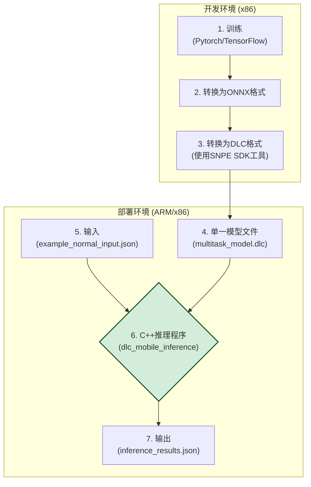
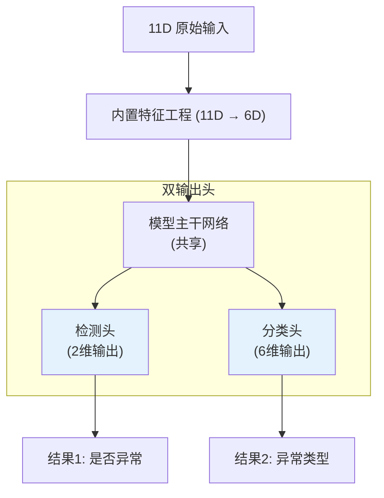
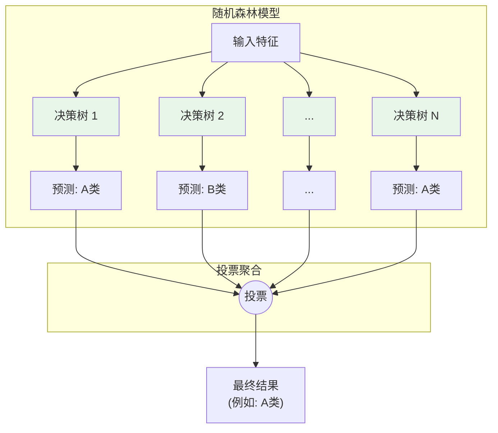
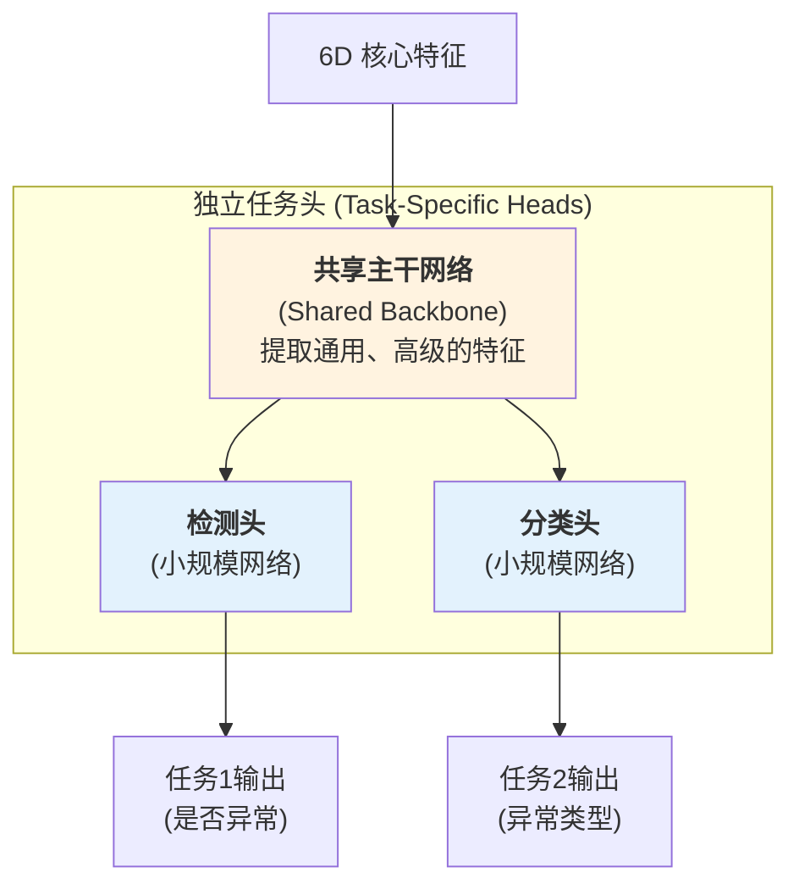

# AI实时网络异常检测系统 - 最终版文档

[](https://github.com)
[](https://github.com)
[](https://www.python.org/)

## 1. 项目概述

本项目是一个端到端的AI解决方案，旨在对实时网络流量进行智能监控，自动检测异常并识别其具体类型。系统最初探索了多种模型方案，最终演进为一个**基于单一多任务神经网络的部署方案**，该方案可以直接在移动和嵌入式设备上高效运行。

与业界单纯依赖统计阈值的方法不同，本系统通过深度学习模型理解网络状态的复杂模式，从而提供更精确、更智能的异常检测能力。最终交付物是一个可以通过C++ API轻松集成到任何监控系统中的高效推理引擎。

---

## 2. 核心优势

- **✅ 端到端解决方案**: 从11维原始JSON数据输入到结构化的JSON结果输出，无需外部依赖。
- **🚀 高效的单一模型**: 采用多任务学习架构，一次推理即可同时完成“异常检测”和“异常分类”两个任务，极大提升了处理效率。
- **📱 移动端优化**: 最终模型被转换为高度优化的`.dlc`格式，专为高通SNPE（骁龙神经处理引擎）设计，完美适用于ARM架构的移动或嵌入式设备。
- **🔧 部署极其简单**: 只需一个`.dlc`模型文件和一个C++可执行程序即可完成部署，极大降低了集成复杂性。
- **🔬 算法透明度高**: 核心的特征工程算法和模型架构都有清晰的文档记录和解释。

---

## 3. 系统架构 (当前版本)

当前系统架构已经高度简化，其核心是C++推理程序，它调用单一的多任务DLC模型来处理输入的JSON数据。



---

## 4. 模型与算法详解

### 4.1. 项目演进：从无法部署到高效方案

本项目的模型选型经历了三个主要阶段，最终的方案是前两个阶段经验积累的成果。

- **阶段一：随机森林 (无法部署)**
    - **方案**: 使用`scikit-learn`的随机森林（Random Forest）进行异常分类。
    - **优点**: 模型解释性强，训练速度快。
    - **致命缺陷**: 在尝试转换为移动端`.dlc`格式时，发现SNPE不支持随机森林所需的`TreeEnsembleClassifier`操作符。**此路不通**。

- **阶段二：双神经网络模型 (部署复杂)**
    - **方案**: 为解决部署问题，我们用两个独立的神经网络来分别实现“异常检测”（自编码器）和“异常分类”（分类网络）。
    - **优点**: 两个模型都可以成功转换为独立的`.dlc`文件，解决了部署的可行性问题。
    - **缺点**: 需要在设备上维护和调用两个模型，推理需要两步，增加了代码复杂度和潜在的性能开销。

- **阶段三：单一多任务模型 (当前方案)**
    - **方案**: 将阶段二的两个网络合并为一个**单一的多任务模型**。该模型共享一个通用的主干网络来提取特征，但有两个独立的“头”分别输出检测和分类的结果。
    - **优点**: **完美解决方案**。只需维护一个模型，一次推理完成所有任务，效率和简洁性达到最优。

### 4.2. 核心算法：11维特征工程

为了提升模型的性能和泛化能力，系统首先会对输入的11维原始数据进行特征工程，将其转换为6个更具信息量的核心特征。C++推理程序已内置此算法。

**11维原始输入:**
- **WiFi信号 (3维)**: `wlan0_wireless_quality`, `wlan0_signal_level`, `wlan0_noise_level`
- **网络流量 (4维)**: `wlan0_rx_packets`, `wlan0_tx_packets`, `wlan0_rx_bytes`, `wlan0_tx_bytes`
- **网络延迟 (2维)**: `gateway_ping_time`, `dns_resolution_time`
- **系统资源 (2维)**: `memory_usage_percent`, `cpu_usage_percent`

**6维核心特征转换公式:**
```python
# 1. 平均信号强度: 综合信号质量和强度
avg_signal_strength = (wlan0_wireless_quality + abs(wlan0_signal_level)) / 20.0

# 2. 平均数据率: 归一化的网络吞吐量
avg_data_rate = min((wlan0_rx_bytes + wlan0_tx_bytes) / 5000000.0, 1.0)

# 3. 平均延迟: 综合网关和DNS延迟
avg_latency = (gateway_ping_time + dns_resolution_time) / 2.0

# 4. 丢包率估算: 基于噪声水平的丢包估算
packet_loss_rate = max(0, (abs(wlan0_noise_level) - 70) / 200.0)

# 5. 系统负载: 归一化的CPU和内存负载
system_load = (cpu_usage_percent + memory_usage_percent) / 200.0

# 6. 网络稳定性: 基于数据包数量的稳定性评估
network_stability = min((wlan0_rx_packets + wlan0_tx_packets) / 50000.0, 1.0)
```

### 4.3. 核心模型：多任务神经网络架构

当前的核心AI模型是一个端到端的多任务神经网络。


- **输入层**: 接收11维原始浮点数数组。
- **内置特征工程**: 在模型内部首先执行4.2节中描述的11维到6维的转换。
- **模型主干**: 一个共享的、由多个全连接层和激活函数（如ReLU）组成的网络，负责从6维核心特征中学习高级表示。
- **输出头**:
    - **检测头**: 一个小网络，输出2个值（正常logit, 异常logit），用于判断是否异常。
    - **分类头**: 另一个小网络，输出6个值（对应6种异常类型的logit），用于判断具体异常类别。

### 4.4. 核心模型原理详解

#### 4.4.1. 随机森林 (初期探索方案)

- **基本原理**: 随机森林是一种强大的**集成学习（Ensemble Learning）**方法。它并非构建单一的复杂模型，而是同时构建大量的、相对简单的**决策树**。在进行分类预测时，每棵决策树都会独立地给出一个自己的判断，最终的结果由所有决策树“投票”决定，得票最多的类别即为最终预测结果。

- **项目初期选择原因**:
    - **高性能**: 在处理像我们这样的表格化（Tabular）数据时，随机森林通常表现出色。
    - **鲁棒性强**: 通过集成多棵树的结果，它能有效避免“过拟合”，对噪声数据不敏感。
    - **可解释性**: 能够计算出每个特征的重要性，帮助我们理解模型的决策依据。

- **在本项目中被放弃的原因**:
    - **部署兼容性问题**: 这是最关键的原因。随机森林模型在转换为移动端支持的`.dlc`格式时，其核心操作符`TreeEnsembleClassifier`不被高通SNPE的转换工具所支持。这意味着基于随机森林的模型**无法在目标硬件上部署**，因此我们必须寻找替代方案。



#### 4.4.2. 多任务神经网络 (当前最终方案)

- **基本原理**: 神经网络模仿生物神经元之间的连接方式，通过分层的节点（神经元）来学习数据中的复杂关系。每一层接收前一层的输出，进行加权求和与非线性变换（通过**激活函数**如ReLU），然后传递给下一层。通过在训练过程中不断调整节点间的权重，网络能够学习到从输入到输出的高度复杂的映射关系。

- **本项目的架构：多任务学习 (Multi-Task Learning)**:
    - 我们没有使用两个完全独立的神经网络，而是采用了一种更高效的**多任务学习**架构。该架构的核心思想是“一心多用”。
    - **共享主干 (Shared Backbone)**: 模型的前半部分是一个共享的神经网络（即“主干”）。无论是为了检测还是为了分类，所有的输入数据都必须先流过这个共享主干。它的任务是学习并提取出对于后续所有任务都有用的**通用高级特征**。
    - **独立任务头 (Task-Specific Heads)**: 在共享主干之后，网络会分叉出两个独立的、规模较小的神经网络（即“头”）。每个头都接收来自主干的相同的高级特征，但各自负责一个特定的任务：
        1.  **检测头**: 专门负责判断“是否异常”这个二分类问题。
        2.  **分类头**: 专门负责识别“是哪种异常”这个多分类问题。

- **选择此方案的优势**:
    - **部署可行性**: 构成神经网络的所有基本操作（如矩阵乘法、加法、ReLU等）都是所有深度学习框架和硬件加速器（包括SNPE）的标准支持项，**完美解决了部署问题**。
    - **极高的运行效率**: 最消耗计算资源的部分——特征提取，在共享主干中**只需进行一次**。相比于运行两个独立的模型，这种方式极大地减少了计算量，非常适合对性能和功耗敏感的移动端场景。
    - **可能带来性能提升**: 通过强迫模型学习一个能同时服务于多个相关任务的“通用特征表示”，多任务学习有时能带来比单个模型更好的泛化能力和准确性。



---

## 5. 部署与测试指南

### 5.1. 环境要求
- **操作系统**: Ubuntu 18.04+ 或其他Linux发行版
- **编译器**: G++ (通过 `build-essential` 安装)
- **Python**: 3.8 或更高版本
- **SNPE SDK**: 项目内已包含 `2.26.2.240911` 版本

### 5.2. Setup: 一键安装与设置
我们提供了一个便利的一键设置脚本 `setup_project.sh`，它会完成以下所有工作：
1.  检查必要的目录和文件是否存在。
2.  设置SNPE SDK所需的环境变量。
3.  调用 `build_mobile_inference.sh` 编译C++推理程序。

**使用方法:**
```bash
# 赋予脚本执行权限
chmod +x setup_project.sh

# 运行脚本
./setup_project.sh
```

### 5.3. 如何运行测试
我们提供了一个核心验证脚本 `test_snpe_environment.py`，用于对整个环境进行端到端的健康检查。

**该脚本会执行以下操作:**
1.  检查SNPE SDK的完整性。
2.  验证DLC模型文件。
3.  检查C++程序是否已成功编译。
4.  **执行一次完整推理**：使用合并后的 `multitask_model.dlc` 和 `example_normal_input.json`，验证程序能否跑通。
5.  检查可用的运行时（CPU、GPU、DSP）。

**运行测试:**
```bash
# 直接运行Python脚本
python3 test_snpe_environment.py
```
如果所有检查通过，您将看到 `✅ SNPE环境验证通过！` 的成功信息。

### 5.4. 手动运行推理
在设置和测试通过后，您可以手动调用推理程序：
```bash
# 用法: ./dlc_mobile_inference <模型文件> <输入JSON文件>
./dlc_mobile_inference multitask_model.dlc example_normal_input.json
```
程序执行后，会生成一个 `inference_results.json` 文件，其中包含了详细的检测结果。

---

## 6. 项目文件结构
```
📦 AI网络异常检测系统/
├── 📄 dlc_mobile_inference          # [产物] C++编译生成的可执行文件
├── 📄 multitask_model.dlc           # [模型] 核心单一DLC模型
├── 📄 example_normal_input.json     # [数据] 标准JSON输入示例
├── 📄 inference_results.json        # [产物] 推理输出结果
│
├── 📁 2.26.2.240911/                  # [依赖] SNPE SDK
├── 📁 models/                       # [资源] 存放各类模型文件 (ONNX, PKL等)
├── 📁 src/                          # [源码] C++和Python源码
├── 📁 scripts/                      # [工具] 辅助脚本
├── 📁 test/                         # [测试] 测试脚本
│
├── 📄 build_mobile_inference.sh     # [工具] C++编译脚本
├── 📄 setup_project.sh              # [工具] 一键环境设置脚本
├── 📄 test_snpe_environment.py      # [测试] 核心环境验证脚本
└── 📄 README.md                     # [文档] 本文档
```

