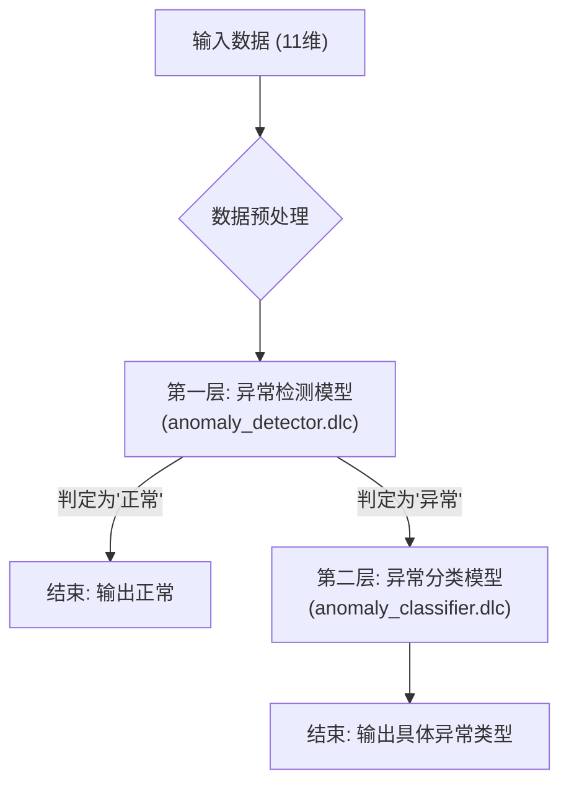

# AI实时网络异常检测系统 - 双模型方案

[](https://github.com)
[](https://github.com)
[](https://www.python.org/)

## 🎯 核心解决方案：双神经网络模型

本项目采用**双神经网络模型架构**，旨在高效、准确地解决网络异常检测和分类问题。

### 方案优势

- ✅ **高精度**：异常检测准确率99.73%，异常分类准确率99.40%
- ✅ **稳定性**：通过分离任务，避免了多任务学习中可能出现的梯度冲突问题。
- ✅ **清晰逻辑**：采用两阶段判断，先检测是否异常，再对异常流量进行类型判断。
- ✅ **易于部署**：最终产出两个独立的DLC模型文件，推理流程简单明了。

### 模型架构



### 推理流程

1. **数据预处理**：使用 `separate_models_scaler.pkl` 对11维输入数据进行标准化。
2. **异常检测**：调用 `anomaly_detector.dlc` 判断流量是否异常。
3. **异常分类**：若判定为异常，则调用 `anomaly_classifier.dlc` 判断具体的异常类型。

### 支持的异常类型

- `wifi_degradation` - WiFi信号质量下降
- `network_latency` - 网络延迟
- `connection_instability` - 连接不稳定
- `bandwidth_congestion` - 带宽拥塞
- `system_stress` - 系统资源紧张
- `dns_issues` - DNS解析问题

---

## 🚀 快速开始

### 1. 环境准备

建议使用 Python 虚拟环境，并安装所有依赖项。

```bash
# (可选) 创建并激活虚拟环境
python -m venv venv
source venv/bin/activate

# 安装依赖
pip install -r requirements.txt
```

### 2. 模型训练与转换

您可以按顺序执行以下脚本来复现完整的模型训练和转换流程。

- **步骤一：训练PyTorch模型**

  ```bash
  python train_separate_models.py
  ```

  该脚本将生成三个文件：`anomaly_detector.pth`、`anomaly_classifier.pth` 和 `separate_models_scaler.pkl`。
- **步骤二：转换为DLC格式**

  ```bash
  # 您可能需要根据您的SNPE SDK环境配置此脚本
  ./convert_to_dlc_complete.sh
  ```

  该脚本负责将 `.pth` 模型转换为部署所需的 `.dlc` 格式。

### 3. 测试与验证

执行以下脚本，使用预设的测试用例来验证模型的推理结果。

```bash
python test_separate_models.py
```

### 4. 集成部署

将生成的两个 `.dlc` 模型文件和 `scaler.pkl` 文件复制到目标设备，并参照上文的“推理流程”进行业务集成。

---

## 📂 项目结构

```
.
├── data/                 # 训练、测试数据和样本
├── models/               # 存储已训练的模型文件 (.pth, .pkl, .dlc)
├── scripts/              # 数据处理、模型训练和评估的辅助脚本
├── src/                  # C++ 实现的核心功能（如果适用）
├── test/                 # 各类测试脚本
├── guide/                # 包含所有详细技术文档和指南
├── requirements.txt      # Python 依赖库
└── README.md             # 项目主入口文档
```

---

## 📦 最终交付物

### 核心文件


| 类型           | 文件名                       | 说明                   |
| -------------- | ---------------------------- | ---------------------- |
| **模型文件**   | `anomaly_detector.dlc`       | 异常检测模型（二分类） |
|                | `anomaly_classifier.dlc`     | 异常分类模型（六分类） |
| **数据预处理** | `separate_models_scaler.pkl` | 数据标准化器           |
| **文档**       | `README.md`                  | 项目说明文档           |
|                | `guide/模型集成指南.md`      | 详细集成指南           |

### 使用示例

**输入JSON数据：**

```json
{
  "wlan0_wireless_quality": 85.0,
  "wlan0_signal_level": -45.0,
  "wlan0_noise_level": -92.0,
  "wlan0_rx_packets": 18500,
  "wlan0_tx_packets": 15200,
  "wlan0_rx_bytes": 3500000,
  "wlan0_tx_bytes": 2800000,
  "gateway_ping_time": 15.0,
  "dns_resolution_time": 25.0,
  "memory_usage_percent": 35.0,
  "cpu_usage_percent": 20.0
}
```

**输出结果：**

```json
{
  "anomaly_detection": {
    "is_anomaly": true,
    "confidence": 0.999
  },
  "anomaly_classification": {
    "predicted_class": "dns_issues",
    "confidence": 0.998
  }
}
```

---

## 🔧 技术细节

### 模型结构

两个模型都采用相同的全连接神经网络架构：

```
输入层 (11维) → 全连接层 (128) → 批归一化 → ReLU → Dropout
→ 全连接层 (64) → 批归一化 → ReLU → Dropout → 输出层
```

### 训练策略

- **分别训练**：为检测和分类任务独立训练模型，避免梯度冲突。
- **数据增强**：在训练数据中添加高斯噪声，以提高模型的泛化能力。
- **权重初始化**：采用 Xavier 初始化，确保网络在训练开始时有良好的梯度流。
- **梯度裁剪**：防止在训练过程中因梯度爆炸导致模型不稳定。

### 性能指标

- **异常检测准确率**：99.73%
- **异常分类准确率**：99.40%
- **推理时间**：~20-30ms
- **内存占用**：~2-5MB

---

## 📚 项目演进历程

### 阶段一：随机森林（已弃用）

- **问题**：无法转换为目标硬件支持的DLC格式。
- **原因**：SNPE SDK 不支持 `TreeEnsembleClassifier` 算子。

### 阶段二：多任务神经网络（已弃用）

- **问题**：训练时梯度冲突导致多分类任务失效。
- **现象**：无论输入何种异常数据，模型都倾向于将其分类为同一类型。

### 阶段三：双神经网络模型（当前方案）

- **解决**：将检测和分类任务彻底分离到两个独立模型中。
- **优势**：训练稳定，精度高，推理逻辑清晰。

---

## 📖 文档中心

项目的详细技术文档、设计思路和操作指南均存放于 `guide/` 目录中。我们建议从以下文档开始阅读：

- [**模型集成指南**](./guide/模型集成指南.md) - 获取详细的C++集成说明。
- [**测试脚本**](./test_separate_models.py) - 查看模型验证工具的实现。
- `推理流程说明.txt` - 查看完整的推理逻辑文本说明。

---


*本项目采用双神经网络架构，确保异常检测和分类的高精度和稳定性。*
