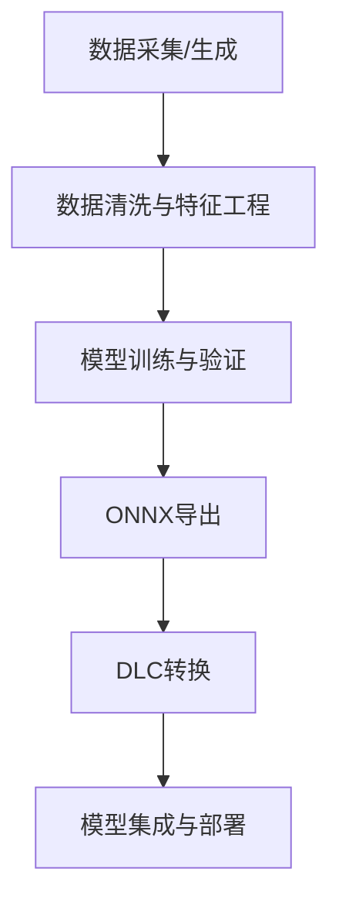

# 端到端AI模型开发流程说明

本指南系统梳理了从原始数据到最终DLC模型部署的完整流程，适合新手和开发者快速理解与查阅。

---

## 1. 数据构造与生成

- **数据来源**：可用真实采集、仿真生成或数据增强
- **典型脚本**：
  - `scripts/generate_6d_training_data.py`：生成6维特征训练数据
  - `scripts/generate_improved_6d_data.py`：生成改进版训练数据
- **说明**：
  - 支持多种异常类型、正常/异常样本自动标注
  - 输出为CSV格式，便于后续处理

---

## 2. 数据预处理与特征工程

- **主要步骤**：
  - 数据清洗（去除异常/缺失值）
  - 特征工程（如11维→6维降维、归一化等）
- **典型脚本**：
  - `src/feature_processor/feature_extractor.py`：核心特征提取逻辑
  - `scripts/prepare_training_data.py`：合并/处理原始数据
- **说明**：
  - 保证输入特征与模型训练/推理时一致
  - 支持批量处理与单条数据处理

---

## 3. 模型训练

- **主脚本**：`train_multitask_model.py`
- **流程**：
  1. 加载并预处理数据
  2. 划分训练/测试集
  3. 定义多任务神经网络结构
  4. 训练与验证（交叉熵损失、Adam优化器）
  5. 保存模型权重（.pth）与ONNX模型
- **评估**：自动输出训练/验证准确率

---

## 4. 模型转换

- **ONNX导出**：训练脚本内自动导出ONNX模型（`multitask_model.onnx`）
- **DLC转换**：
  - 使用`convert_pytorch_to_dlc.py`或`snpe-onnx-to-dlc`工具
  - 生成`multitask_model.dlc`，适配高通SNPE
- **注意事项**：
  - 保证ONNX模型结构与推理环境兼容
  - 转换前可用`validate_dlc_model.py`进行模型有效性验证

---

## 5. 典型命令行用法

```bash
# 1. 生成训练数据
python3 scripts/generate_6d_training_data.py

# 2. 数据预处理/合并
python3 scripts/prepare_training_data.py

# 3. 训练模型
python3 train_multitask_model.py

# 4. 转换为DLC
python3 convert_pytorch_to_dlc.py

# 5. 验证DLC模型
python3 validate_dlc_model.py
```

---

## 6. 整体流程图



---

如需详细了解每一步的脚本和参数，请查阅对应的Python文件和项目文档。 