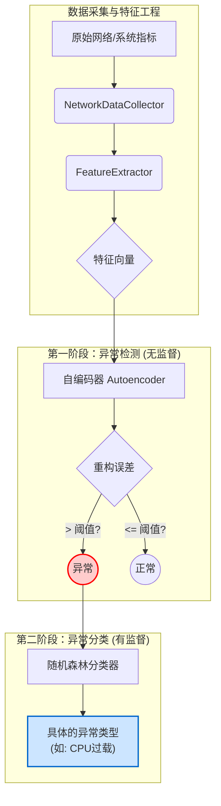
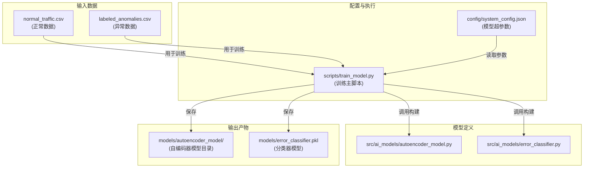
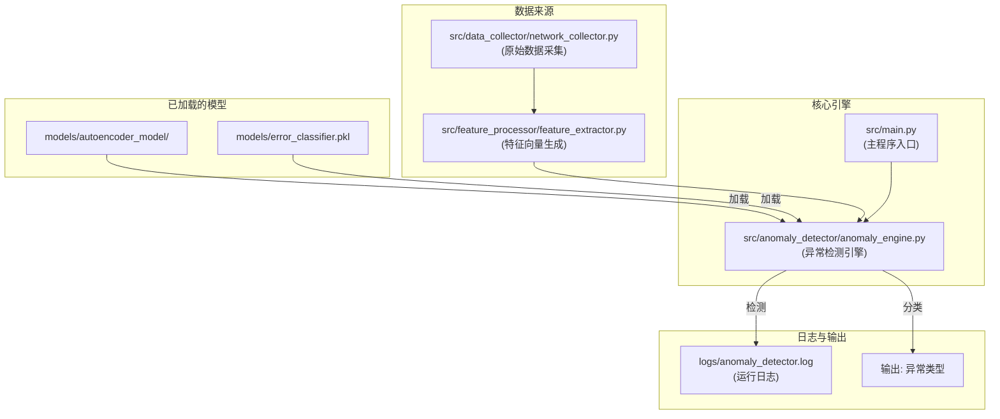

# AI 模型架构与工作原理解析

本文档详细阐述了本AI网络异常检测系统的核心模型架构、工作原理、技术选型以及各模块文件之间的协同工作流程。



## 1. 总体架构：双阶段检测模型

本系统采用了一种先进的 **"先检测，后分类" (Detect-then-Classify)** 的双阶段混合模型架构。这种设计兼顾了对未知异常的发现能力和对已知异常的精确分类能力。

- **第一阶段：无监督异常检测 (Unsupervised Anomaly Detection)**
  
  - **目标**：判断当前网络流量 **是否** 异常。
  - **模型**：**自编码器 (Autoencoder)**。
  - **特点**：该模型仅在"正常"数据上进行训练，因此它不认识任何具体的异常类型。它的优势在于，任何与"正常模式"不符的数据（即使是前所未见的异常类型）都可能被它识别出来。
- **第二阶段：有监督异常分类 (Supervised Anomaly Classification)**
  
  - **目标**：如果第一阶段判定为异常，则进一步识别这是 **哪一种** 异常。
  - **模型**：**随机森林分类器 (Random Forest Classifier)**。
  - **特点**：该模型在一个包含明确标签的"异常"数据集上进行训练。它像一个专家，能够精确地将异常情况归类到已知的类别中（如 `cpu_overload`, `signal_interference` 等）。

---

## 2. 核心原理解析

### 第一阶段：自编码器 (Autoencoder)

- **核心原理**：
  自编码器是一种神经网络，其目标是学习如何高效地压缩数据（编码）并从压缩表示中重构出原始数据（解码）。它被刻意地只在 `normal_traffic.csv` （正常数据）上训练，因此它只擅长于重构"正常"的模式。
  
  - 当输入一个 **正常** 的特征向量时，模型可以很好地重构它，**重构误差**（输入与输出的差异）会很小。
  - 当输入一个 **异常** 的特征向量时，由于模型从未学习过这种模式，它无法有效地重构，导致**重构误差**变得非常大。
    我们通过设定一个合理的"重构误差阈值"，当误差超过这个阈值时，系统就判定发生了异常。
- **实现工具**：
  
  - [**TensorFlow**](https://www.tensorflow.org/) (通过其高级API [**Keras**](https://keras.io/))：一个功能强大且灵活的深度学习框架，非常适合构建神经网络模型。
- **相关文件**：
  
  - `src/ai_models/autoencoder_model.py`: 定义了自编码器神经网络的结构（编码层、解码层）。
  - `models/autoencoder_model/`: 训练完成后保存的模型目录，采用TensorFlow SavedModel格式。
  - `models/autoencoder_model/autoencoder_scaler.pkl`: 数据标准化器，用于预处理输入数据。
  - `models/autoencoder_model/autoencoder_config.json`: 模型配置和训练历史信息。

### 第二阶段：随机森林 (Random Forest)

- **核心原理**：
  随机森林是一种强大的**集成学习**算法。它由许多棵独立的"决策树"组成。
  
  - 在训练时，算法会从带标签的异常数据 (`labeled_anomalies.csv`) 中有放回地随机抽取样本子集，并为每一棵树随机选择一部分特征进行训练。
  - 在预测时，当一个异常向量被输入模型，森林中的每一棵决策树都会独立地对该异常进行分类（"投票"）。最终，算法会选择得票最多的那个类别作为最终的分类结果。
  - 这种"集体决策"的机制使得随机森林非常稳定且不易过拟合，分类准确率高。
- **实现工具**：
  
  - [**Scikit-learn**](https://scikit-learn.org/)：Python中最流行和全面的机器学习库，提供了随机森林等大量开箱即用的算法。
- **相关文件**：
  
  - `src/ai_models/error_classifier.py`: 封装了随机森林模型的训练和预测逻辑。
  - `models/error_classifier.pkl`: 训练完成后保存的模型文件，采用pickle序列化格式。

---

## 3. 文件交互与工作流程

理解各个文件如何协同工作是掌握项目关键。下面是**训练**和**实时检测**两个核心场景下的文件交互流程。

### 场景一：模型训练



**核心训练原理说明**

您可能会问：既然 `normal_traffic.csv` 中只有正常数据，模型是如何进行训练和验证的？两个模型又是如何协同工作的？

这里的核心思想是 **"职责分离"** 与 **"内部验证"**。

1.  **自编码器：只学习"正常"**
    -   **目标**：成为一个"正常模式"的专家。
    -   **数据使用**：训练时 **只使用 `normal_traffic.csv`**。它完全不接触任何异常数据。
    -   **内部验证**：`train_model.py` 脚本在内部会将 `normal_traffic.csv` 的数据自动划分为 **训练集**（如80%）和 **验证集**（如20%）。模型在训练集上学习，在验证集上测试其泛化能力（即处理未见过的新正常数据的能力）。这就是日志中 `final_loss` 和 `final_val_loss` 的来源。只有对"正常"的定义足够精确，它才能在面对"异常"时产生巨大的重构误差。

2.  **随机森林：只学习"异常"**
    -   **目标**：成为一个"异常模式"的分类专家。
    -   **数据使用**：训练时 **只使用 `labeled_anomalies.csv`**。它的任务是在已经被告知某个数据是"异常"的前提下，分辨出它具体属于哪一类。

**总结：两个模型绝不会使用对方的数据进行训练。** 这种分离设计确保了自编码器能检测到任何偏离常规的模式（包括未知异常），而分类器则能精确诊断已知的故障类型。

**流程描述**：
1.  **用户** 运行 `python scripts/train_model.py` 命令。
2. 该脚本首先从 `config/system_config.json` 文件中读取模型的超参数（如网络层数、学习率、树的数量等）。
3. **训练自编码器时**：脚本调用 `src/ai_models/autoencoder_model.py` 来构建模型结构，然后加载 `data/normal_traffic.csv` 数据进行训练，最终将训练好的模型保存到 `models/autoencoder_model/` 目录中，同时保存数据预处理器和配置信息。
4. **训练分类器时**：脚本调用 `src/ai_models/error_classifier.py`，加载 `data/labeled_anomalies.csv` 数据进行训练，最终将模型保存为 `models/error_classifier.pkl`。

### 场景二：实时异常检测



**流程描述**：

1. **启动**：用户运行 `python src/main.py` 启动整个应用。
2. **初始化**：`main.py` 创建并启动 `AnomalyEngine` (`src/anomaly_detector/anomaly_engine.py`)。`AnomalyEngine` 在初始化时会加载 `models/` 目录下的两个训练好的模型。
3. **数据流**：`NetworkDataCollector` 持续从系统采集原始指标，传递给 `FeatureExtractor` 生成实时特征向量。
4. **检测**：特征向量被送入 `AnomalyEngine` 中已加载的自编码器模型。
5. **判断与分类**：
   - 如果重构误差**低于**阈值，判定为正常，流程结束。
   - 如果重构误差**高于**阈值，判定为异常。该异常向量会立刻被送入随机森林模型进行分类。
6. **输出**：分类结果（具体的异常类型）被输出，同时所有关键步骤和结果都被记录在 `logs/anomaly_detector.log` 日志文件中。

---

## 4. 解读模型训练结果

当您运行 `scripts/train_model.py` 脚本训练自编码器后，会在日志 (`logs/anomaly_detector.log`) 中看到类似下面这样的一条训练结果记录。理解这些指标的含义对于评估和优化模型至关重要。

```
INFO - 训练结果: {'final_loss': 0.7889, 'final_val_loss': 0.7907, 'epochs_trained': 90, 'threshold': 1.0333, 'model_saved': True}
```

下面是对每个参数的详细解读：

- `final_loss` (最终训练损失):
    
    - **含义**: 这是模型在完成所有训练后，在**训练数据集**上的最终"重构误差"。这个值越低，说明模型对它学习过的"正常"数据的重构能力越强。
    - **示例解读**: `0.7889` 是一个相对较低的损失值，表明模型已经很好地学习到了正常数据模式。
- `final_val_loss` (最终验证损失):
    
    - **含义**: 这是模型在**验证数据集**（一部分未参与训练的正常数据）上的最终"重构误差"。这个指标是评估模型**泛化能力**的关键。
    - **示例解读**: `0.7907` 与 `final_loss` 非常接近，这是一个非常好的迹象。它说明模型没有**过拟合**（Overfitting），即它不仅仅是"背下"了训练数据，而是真正学会了正常数据的通用模式，能够很好地处理从未见过的新正常数据。
- `epochs_trained` (已训练轮数):
    
    - **含义**: 表示模型实际训练了多少个轮次（Epoch）。一个轮次指模型完整地学习了一遍所有的训练数据。
    - **示例解读**: `90` 表示训练一共进行了90轮。这个值可能少于您在配置中设定的总轮数，这通常是因为触发了**早停（Early Stopping）**机制——当模型的 `final_val_loss` 在连续多个轮次内不再下降时，训练会自动停止以防止过拟合并节省时间。
- `threshold` (异常检测阈值):
    
    - **含义**: 这是系统自动计算出的用于区分"正常"与"异常"的分界线。在模型训练完成后，系统会用验证数据来计算一个合理的重构误差阈值。
    - **示例解读**: `1.0333` 是本次训练得到的阈值。在实时检测中，任何输入数据的重构误差如果**大于1.0333**，就会被判定为异常。这个值决定了检测的灵敏度。
- `model_saved` (模型已保存):
    
    - **含义**: 一个布尔值，`True` 表示训练成功并且最终的模型已经保存到 `models/` 目录下（例如 `autoencoder.h5`）。`False` 则表示因某些原因保存失败。
        

---

---

