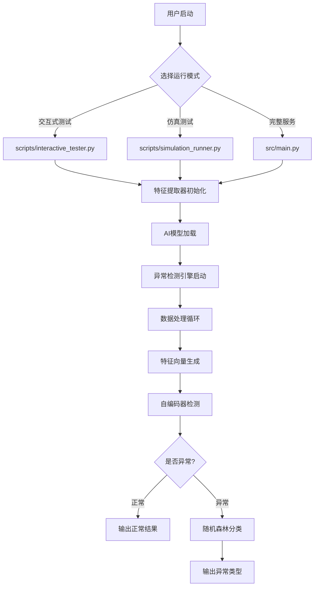

# AI 模型运行原理与文件架构详解

本文档详细解释 AI 网络异常检测系统的运行原理，包括模型如何工作、各个文件的作用，以及完整的数据流转过程。

## 1. 系统运行概览

### 核心运行流程



### 系统启动的三种方式

1. **交互式测试** (`scripts/interactive_tester.py`)
   - 用途：手动输入数据进行测试
   - 特点：人机交互，逐步输入各项指标
   - 适用：开发调试、演示展示

2. **仿真测试** (`scripts/simulation_runner.py`)
   - 用途：使用预定义数据批量测试
   - 特点：自动化测试多个场景
   - 适用：模型验证、回归测试

3. **完整服务** (`src/main.py`)
   - 用途：生产环境中的实时监控
   - 特点：持续采集系统数据并检测
   - 适用：实际部署运行

## 2. 关键文件架构解析

### 2.1 配置文件
- **`config/system_config.json`**
  - 作用：定义所有模型参数、文件路径、阈值等
  - 内容：模型超参数、数据采集配置、日志设置
  - 重要性：★★★★★ （核心配置）

### 2.2 训练数据文件
- **`data/normal_traffic.csv`**
  - 作用：自编码器训练的正常数据
  - 格式：28个特征列，18000行数据
  - 用途：让自编码器学习"正常"的网络模式

- **`data/labeled_anomalies.csv`**
  - 作用：随机森林分类器的训练数据
  - 格式：28个特征列 + 1个标签列，约2000行数据
  - 用途：让分类器学会识别不同类型的异常

### 2.3 模型文件
- **`models/autoencoder_model/`** （目录）
  - `saved_model.pb`：TensorFlow 模型结构和权重
  - `variables/`：模型变量
  - `autoencoder_scaler.pkl`：数据标准化器
  - `autoencoder_config.json`：模型配置和训练历史

- **`models/error_classifier.pkl`**
  - 作用：随机森林分类器的完整模型
  - 包含：训练好的决策树、标签编码器、统计信息

### 2.4 核心算法文件
- **`src/ai_models/autoencoder_model.py`**
  - 功能：自编码器的定义、训练、预测
  - 关键方法：`build_model()`, `train()`, `predict()`

- **`src/ai_models/error_classifier.py`**
  - 功能：随机森林分类器的封装
  - 关键方法：`build_classifier()`, `train()`, `classify_error()`

### 2.5 数据处理文件
- **`src/feature_processor/feature_extractor.py`**
  - 功能：将原始系统指标转换为28维特征向量
  - 处理：统计计算、数据聚合、标准化

- **`src/anomaly_detector/anomaly_engine.py`**
  - 功能：整合两个模型，实现完整的检测流程
  - 作用：数据流转的中央控制器

## 3. 详细运行原理

### 3.1 模型初始化阶段

**步骤1：配置加载**
```python
# 从 config/system_config.json 读取配置
config = load_config()
```

**步骤2：日志系统启动**
```python
# 基于配置初始化日志记录器
logger = SystemLogger(config['logging'])
```

**步骤3：特征提取器初始化**
```python
# 准备数据预处理组件
feature_extractor = FeatureExtractor(config['data_collection']['metrics'], logger)
```

**步骤4：AI模型加载**
```python
# 加载自编码器（从 models/autoencoder_model/ 目录）
autoencoder = AutoencoderModel(config['ai_models']['autoencoder'], logger)

# 加载分类器（从 models/error_classifier.pkl 文件）
classifier = ErrorClassifier(config['ai_models']['classifier'], logger)
```

**步骤5：检测引擎初始化**
```python
# 将两个模型整合到检测引擎中
anomaly_engine = AnomalyDetectionEngine(
    config=config['anomaly_detection'],
    autoencoder=autoencoder,
    error_classifier=classifier,
    logger=logger
)
```

### 3.2 实时检测阶段

**步骤1：原始数据输入**
```
输入示例：
{
    "wlan0_wireless_quality": 70.0,
    "wlan0_wireless_level": -55.0,
    "wlan0_packet_loss_rate": 0.01,
    "gateway_ping_time": 12.5,
    "cpu_percent": 15.0,
    ...
}
```

**步骤2：特征向量生成**
```python
# feature_extractor.py 中的处理
feature_vector = extractor.extract_features(raw_input)
# 输出：28维浮点数数组，如：[-0.7071, 1.2247, 0.0000, ...]
```

**步骤3：数据标准化**
```python
# autoencoder_model.py 中的预处理
processed_data = self._preprocess_data(feature_vector)
# 使用训练时保存的 StandardScaler 进行标准化
```

**步骤4：自编码器检测**
```python
# 重构输入数据
reconstructed = self.model.predict(processed_data)

# 计算重构误差
reconstruction_error = np.mean(np.square(processed_data - reconstructed))

# 与阈值比较
is_anomaly = reconstruction_error > self.threshold
```

**步骤5：异常分类（如果需要）**
```python
if is_anomaly:
    # 使用随机森林进行分类
    predicted_class = classifier.classify_error(feature_vector)
    # 输出：异常类型和置信度
```

### 3.3 关键数据结构

**特征向量（28维）**
```
[avg_data_rate, max_data_rate, avg_latency, max_latency, 
 avg_signal_strength, cpu_usage, memory_usage, 
 global_mean, global_std, global_skewness, global_kurtosis, ...]
```

**自编码器输出**
```python
{
    'is_anomaly': True/False,
    'reconstruction_error': 0.8234,
    'threshold': 1.1386,
    'confidence': 0.72,
    'anomaly_score': 0.72
}
```

**分类器输出**
```python
{
    'predicted_class': 'anomaly_cluster_3',
    'confidence': 0.85,
    'is_confident': True,
    'class_probabilities': {
        'anomaly_cluster_1': 0.10,
        'anomaly_cluster_2': 0.05,
        'anomaly_cluster_3': 0.85,
        ...
    }
}
```

## 4. 模型文件的加载机制

### 4.1 自编码器模型加载

**位置**: `src/ai_models/autoencoder_model.py` 的 `_load_model()` 方法

```python
def _load_model(self):
    model_dir = self.model_path  # "models/autoencoder_model"
    
    # 1. 加载 TensorFlow SavedModel
    if os.path.exists(model_dir):
        self.model = tf.saved_model.load(model_dir)
        
    # 2. 加载数据标准化器
    scaler_file = os.path.join(model_dir, 'autoencoder_scaler.pkl')
    if os.path.exists(scaler_file):
        self.scaler = joblib.load(scaler_file)
        
    # 3. 重构编码器子模型
    encoder_layer = self.model.get_layer(name='encoder_layer2')
    if encoder_layer:
        self.encoder = keras.Model(inputs=input_layer, outputs=encoder_layer.output)
```

### 4.2 分类器模型加载

**位置**: `src/ai_models/error_classifier.py` 的 `_load_model()` 方法

```python
def _load_model(self):
    if os.path.exists(self.model_path):  # "models/error_classifier.pkl"
        model_data = joblib.load(self.model_path)
        
        # 恢复所有组件
        self.classifier = model_data.get('classifier')
        self.label_encoder = model_data.get('label_encoder')
        self.classes = model_data.get('classes')
        self.confidence_threshold = model_data.get('confidence_threshold')
```

## 5. 性能优化要点

### 5.1 模型推理优化
- **批处理**：支持单个和批量数据处理
- **缓存**：StandardScaler 只需要加载一次
- **内存管理**：及时清理中间变量

### 5.2 检测阈值动态调整
- **自动计算**：基于训练数据的95%分位数
- **手动调整**：支持运行时阈值更新
- **历史记录**：保存阈值变更历史

### 5.3 错误处理机制
- **模型缺失**：提供默认分类结果
- **数据异常**：自动处理 NaN 和无穷值
- **推理失败**：返回错误信息而不是崩溃

## 6. 调试和监控

### 6.1 日志文件
- **位置**: `logs/anomaly_detector.log`
- **内容**: 模型加载、推理过程、异常检测结果
- **级别**: DEBUG, INFO, WARNING, ERROR

### 6.2 性能指标
- **推理次数**: `inference_count`
- **异常检测次数**: `anomaly_count` 
- **异常率**: `anomaly_count / inference_count`

### 6.3 模型统计
- **重构误差分布**: 监控模型健康状态
- **分类准确率**: 跟踪分类器性能
- **置信度分布**: 评估预测可靠性

