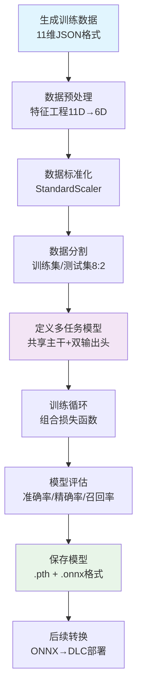

# Python模型训练流程说明

本指南详细介绍如何基于Python脚本（如`train_multitask_model.py`）完成AI网络异常检测模型的训练。

---

## 1. 训练脚本入口

- **主脚本**：`train_multitask_model.py`
- **作用**：负责数据准备、模型定义、训练、评估和模型保存。

---

## 2. 训练数据格式详解

### 2.1. 11维原始网络监控数据格式

训练数据采用JSON格式，包含11个维度的网络监控指标：

```json
{
  "wlan0_wireless_quality": 85.0,
  "wlan0_signal_level": -45.0,
  "wlan0_noise_level": -85.0,
  "wlan0_rx_packets": 1250,
  "wlan0_tx_packets": 980,
  "wlan0_rx_bytes": 2048576,
  "wlan0_tx_bytes": 1024000,
  "gateway_ping_time": 12.5,
  "dns_resolution_time": 8.2,
  "memory_usage_percent": 65.0,
  "cpu_usage_percent": 45.0
}
```

**各字段说明：**
- **WiFi信号指标（3维）**：
  - `wlan0_wireless_quality`：WiFi信号质量（0-100）
  - `wlan0_signal_level`：信号强度（dBm，通常-100到-30）
  - `wlan0_noise_level`：噪声水平（dBm，通常-100到-50）

- **网络流量指标（4维）**：
  - `wlan0_rx_packets`：接收数据包数量
  - `wlan0_tx_packets`：发送数据包数量
  - `wlan0_rx_bytes`：接收字节数
  - `wlan0_tx_bytes`：发送字节数

- **网络延迟指标（2维）**：
  - `gateway_ping_time`：网关ping延迟（毫秒）
  - `dns_resolution_time`：DNS解析时间（毫秒）

- **系统资源指标（2维）**：
  - `memory_usage_percent`：内存使用率（0-100%）
  - `cpu_usage_percent`：CPU使用率（0-100%）

### 2.2. 数据生成与分布

训练数据通过 `generate_improved_6d_data.py` 等脚本生成，具有以下特点：

- **数据分布**：75%正常样本，25%异常样本
- **异常类型**：6种预定义的网络异常类型
- **数据量**：通常生成10,000-50,000个样本
- **数据增强**：训练时添加随机噪声提高模型鲁棒性

### 2.3. 标签格式

每个训练样本包含两种标签：

```json
{
  "features": [85.0, -45.0, -85.0, 1250, 980, 2048576, 1024000, 12.5, 8.2, 65.0, 45.0],
  "detection_label": 0,  // 0=正常, 1=异常
  "classification_label": 0  // 0=正常, 1-6=异常类型
}
```

**标签说明：**
- **检测标签（detection_label）**：二分类标签
  - `0`：正常网络状态
  - `1`：异常网络状态

- **分类标签（classification_label）**：多分类标签
  - `0`：正常
  - `1`：WiFi信号衰减
  - `2`：网络延迟异常
  - `3`：系统资源过载
  - `4`：网络拥塞
  - `5`：DNS解析异常
  - `6`：数据包丢失

---

## 3. 数据准备与特征工程

### 3.1. 11维到6维特征转换

模型内部将11维原始数据转换为6维核心特征：

```python
# 特征转换算法（内置在模型中）
def feature_extraction(raw_data):
    # 1. 平均信号强度
    avg_signal_strength = (wlan0_wireless_quality + abs(wlan0_signal_level)) / 20.0
    
    # 2. 平均数据率
    avg_data_rate = min((wlan0_rx_bytes + wlan0_tx_bytes) / 5000000.0, 1.0)
    
    # 3. 平均延迟
    avg_latency = (gateway_ping_time + dns_resolution_time) / 2.0
    
    # 4. 丢包率估算
    packet_loss_rate = max(0, (abs(wlan0_noise_level) - 70) / 200.0)
    
    # 5. 系统负载
    system_load = (cpu_usage_percent + memory_usage_percent) / 200.0
    
    # 6. 网络稳定性
    network_stability = min((wlan0_rx_packets + wlan0_tx_packets) / 50000.0, 1.0)
    
    return [avg_signal_strength, avg_data_rate, avg_latency, 
            packet_loss_rate, system_load, network_stability]
```

### 3.2. 数据标准化

训练前对6维特征进行标准化处理：

```python
# 使用StandardScaler进行标准化
from sklearn.preprocessing import StandardScaler

scaler = StandardScaler()
features_scaled = scaler.fit_transform(features)
```

标准化后的数据具有零均值和单位方差，有助于模型收敛。

### 3.3. 数据分割

```python
# 按8:2比例分割训练集和测试集
from sklearn.model_selection import train_test_split

X_train, X_test, y_det_train, y_det_test, y_cls_train, y_cls_test = train_test_split(
    features_scaled, detection_labels, classification_labels, 
    test_size=0.2, random_state=42, stratify=detection_labels
)
```

---

## 4. 模型结构与多任务学习

### 4.1. 多任务神经网络架构

```python
class MultiTaskNetwork(nn.Module):
    def __init__(self):
        super().__init__()
        
        # 共享主干网络（6维输入）
        self.backbone = nn.Sequential(
            nn.Linear(6, 64),
            nn.ReLU(),
            nn.Dropout(0.3),
            nn.Linear(64, 32),
            nn.ReLU(),
            nn.Dropout(0.2)
        )
        
        # 检测头（二分类）
        self.detection_head = nn.Sequential(
            nn.Linear(32, 16),
            nn.ReLU(),
            nn.Linear(16, 2)  # 2个输出：正常/异常
        )
        
        # 分类头（多分类）
        self.classification_head = nn.Sequential(
            nn.Linear(32, 16),
            nn.ReLU(),
            nn.Linear(16, 7)  # 7个输出：正常+6种异常
        )
    
    def forward(self, x):
        # 特征提取
        features = self.backbone(x)
        
        # 双任务输出
        detection_output = self.detection_head(features)
        classification_output = self.classification_head(features)
        
        return detection_output, classification_output
```

### 4.2. 多任务学习优势

- **共享特征学习**：主干网络学习对两个任务都有用的通用特征
- **效率提升**：一次前向传播完成两个任务
- **性能提升**：多任务学习通常比单任务模型泛化能力更强

---

## 5. 训练流程详解

### 5.1. 损失函数设计

```python
# 组合损失函数
def combined_loss(detection_output, classification_output, 
                 detection_target, classification_target):
    
    # 检测任务损失（二分类交叉熵）
    detection_loss = F.cross_entropy(detection_output, detection_target)
    
    # 分类任务损失（多分类交叉熵）
    classification_loss = F.cross_entropy(classification_output, classification_target)
    
    # 加权组合（可调整权重）
    total_loss = 0.4 * detection_loss + 0.6 * classification_loss
    
    return total_loss, detection_loss, classification_loss
```

### 5.2. 训练参数配置

```python
# 训练超参数
LEARNING_RATE = 0.001
BATCH_SIZE = 64
EPOCHS = 100
WEIGHT_DECAY = 1e-5

# 优化器
optimizer = torch.optim.Adam(model.parameters(), 
                           lr=LEARNING_RATE, 
                           weight_decay=WEIGHT_DECAY)

# 学习率调度器
scheduler = torch.optim.lr_scheduler.ReduceLROnPlateau(
    optimizer, mode='min', factor=0.5, patience=10, verbose=True
)
```

### 5.3. 训练循环

```python
for epoch in range(EPOCHS):
    model.train()
    total_loss = 0
    
    for batch_features, batch_det_labels, batch_cls_labels in train_loader:
        # 前向传播
        det_output, cls_output = model(batch_features)
        
        # 计算损失
        loss, det_loss, cls_loss = combined_loss(
            det_output, cls_output, batch_det_labels, batch_cls_labels
        )
        
        # 反向传播
        optimizer.zero_grad()
        loss.backward()
        optimizer.step()
        
        total_loss += loss.item()
    
    # 验证
    model.eval()
    val_accuracy = validate_model(model, val_loader)
    
    # 学习率调整
    scheduler.step(total_loss)
```

### 5.4. 数据增强

训练过程中应用数据增强提高模型鲁棒性：

```python
def add_noise(features, noise_factor=0.01):
    """添加随机噪声进行数据增强"""
    noise = torch.randn_like(features) * noise_factor
    return features + noise
```

---

## 6. 训练结果产物与后续转换

### 6.1. 模型保存

```python
# 保存PyTorch模型
torch.save({
    'model_state_dict': model.state_dict(),
    'scaler': scaler,
    'model_config': model_config
}, 'multitask_model.pth')

# 导出ONNX格式
torch.onnx.export(model, dummy_input, 'multitask_model.onnx',
                 input_names=['input'], 
                 output_names=['detection_output', 'classification_output'],
                 dynamic_axes={'input': {0: 'batch_size'},
                             'detection_output': {0: 'batch_size'},
                             'classification_output': {0: 'batch_size'}})
```

### 6.2. 模型评估指标

训练完成后评估以下指标：

- **检测任务**：准确率、精确率、召回率、F1分数
- **分类任务**：准确率、混淆矩阵、各类别精确率
- **整体性能**：平均准确率、模型大小、推理速度

---

## 7. 典型命令行用法

```bash
# 训练模型
python3 train_multitask_model.py

# 转换为ONNX
# （脚本内已自动导出ONNX，无需单独命令）

# 验证模型性能
python3 validate_dlc_model.py
```

---

## 8. 完整训练流程图



---

## 9. 相关文件说明

- **`train_multitask_model.py`**：主训练脚本
- **`generate_improved_6d_data.py`**：数据生成脚本
- **`INPUT_FORMAT_SPECIFICATION.md`**：详细输入格式规范
- **`data/README.md`**：数据目录说明和格式要求

如需详细代码解读，请参考上述脚本文件。 