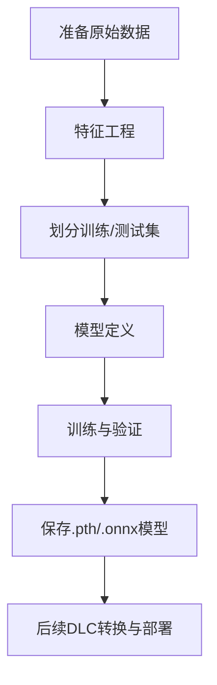

# Python模型训练流程说明

本指南详细介绍如何基于Python脚本（如`train_multitask_model.py`）完成AI网络异常检测模型的训练。

---

## 1. 训练脚本入口

- **主脚本**：`train_multitask_model.py`
- **作用**：负责数据准备、模型定义、训练、评估和模型保存。

---

## 2. 数据准备与特征工程

- 读取原始网络监控数据（11维指标）。
- 进行特征工程（如归一化、降维等）。
- 划分训练集和测试集，保证数据分布合理。

---

## 3. 模型结构与多任务学习

- **模型类型**：多任务神经网络（Multi-Task Learning）
- **结构**：
  - 共享主干网络提取通用特征
  - 检测头：判断是否异常（二分类）
  - 分类头：判断异常类型（多分类）

---

## 4. 训练流程

- **损失函数**：二分类和多分类交叉熵损失
- **优化器**：Adam
- **训练过程**：
  1. 数据批量送入模型
  2. 前向传播，计算损失
  3. 反向传播，更新参数
  4. 每轮评估验证集准确率
- **模型保存**：训练完成后保存为`.pth`（PyTorch权重）和`.onnx`（中间格式）

---

## 5. 训练结果产物与后续转换

- **产物**：
  - `multitask_model.pth`（PyTorch权重）
  - `multitask_model.onnx`（ONNX格式，便于后续转换为DLC）
- **后续**：使用转换脚本将ONNX模型转为DLC格式，部署到目标设备

---

## 6. 典型命令行用法

```bash
# 训练模型
python3 train_multitask_model.py

# 转换为ONNX
# （脚本内已自动导出ONNX，无需单独命令）
```

---

## 7. 流程图



---

如需详细代码解读，请参考`train_multitask_model.py`脚本。 