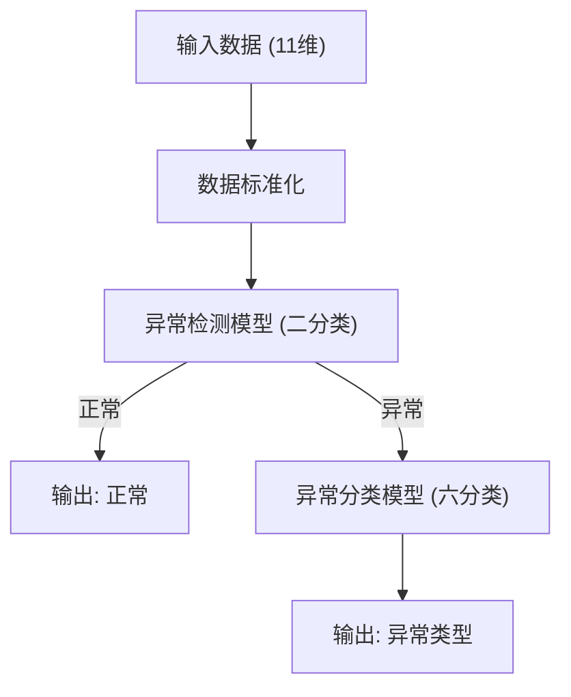
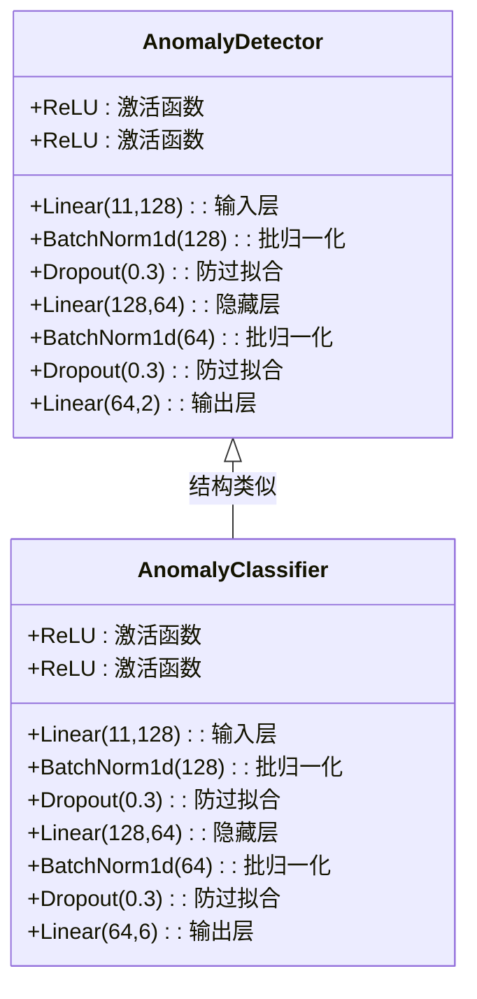
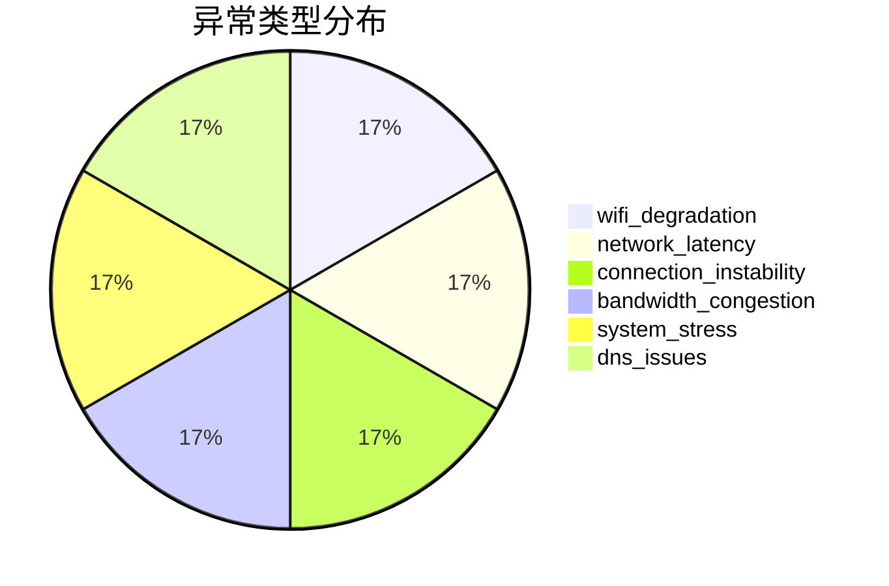

# 网络异常检测系统 - 模型原理简明版

---

## 1. 系统核心流程

- 输入11个网络与系统指标
- 先用异常检测模型判断是否异常
- 仅异常时调用分类模型，输出具体异常类型

---

## 2. 双神经网络结构详解

### 网络层详细说明

#### 输入层 (Linear)
- **功能**: 将11维特征映射到128维特征空间
- **参数**: 11×128权重 + 128偏置 = 1,408个参数
- **作用**: 扩大特征维度，增强模型表达能力

#### 批归一化层 (BatchNorm)
- **功能**: 标准化每批数据的分布
- **参数**: 128个缩放参数 + 128个偏移参数 = 256个参数
- **作用**: 加速训练收敛，提高模型稳定性

#### 激活函数 (ReLU)
- **公式**: f(x) = max(0, x)
- **功能**: 引入非线性，解决梯度消失问题
- **作用**: 计算简单，训练效率高

#### Dropout层
- **功能**: 随机丢弃30%的神经元
- **作用**: 防止过拟合，提高泛化能力

#### 隐藏层 (Linear)
- **功能**: 将128维特征压缩到64维
- **参数**: 128×64权重 + 64偏置 = 8,192个参数
- **作用**: 特征降维，提取关键信息

#### 输出层 (Linear)
- **检测模型**: 64×2权重 + 2偏置 = 130个参数，输出正常/异常概率
- **分类模型**: 64×6权重 + 6偏置 = 390个参数，输出6种异常类型概率

### 参数统计
- **检测模型总参数**: 10,306个
- **分类模型总参数**: 10,566个
- **模型大小**: 约40-50KB

---

## 3. 异常类型分布

- 训练数据中6类异常均衡，提升分类鲁棒性

---

## 4. 主要输入特征

| 特征名                  | 说明           |
|------------------------|----------------|
| wlan0_wireless_quality | WiFi信号质量   |
| wlan0_signal_level     | 信号强度(dBm)  |
| wlan0_noise_level      | 噪声水平(dBm)  |
| wlan0_rx_packets       | 接收包数       |
| wlan0_tx_packets       | 发送包数       |
| wlan0_rx_bytes         | 接收字节数     |
| wlan0_tx_bytes         | 发送字节数     |
| gateway_ping_time      | 网关延迟(ms)   |
| dns_resolution_time    | DNS解析(ms)    |
| memory_usage_percent   | 内存占用(%)    |
| cpu_usage_percent      | CPU占用(%)     |

---

## 5. 性能指标

| 指标         | 数值         |
|--------------|--------------|
| 检测准确率   | 99.73%       |
| 分类准确率   | 99.40%       |
| 推理延迟     | 20-30ms      |
| 内存占用     | 2-5MB        |

---

## 6. 技术亮点

- 检测与分类分离，避免多任务冲突
- 仅异常时分类，节省资源
- 结构简洁，易于部署
- 支持多平台（路由器/云端）

---

如需详细原理，请参见《模型原理详细说明》。 