# AI实时网络异常检测系统 - 汇报大纲

本文档旨在为“AI实时网络异常检测系统”项目汇报提供一份详细的、可直接用于制作PPT的内容大纲。

---

## Slide 1: 封面页

- **标题**: AI实时网络异常检测系统
- **副标题**: 项目成果汇报
- **汇报人**: (您的姓名)
- **日期**: (汇报日期)

---

## Slide 2: 目录/议程

1. **项目概述**: 我们要解决什么问题？
2. **核心优势**: 我们的方案好在哪里？
3. **系统架构**: 整体方案是如何运作的？
4. **模型演进之路**: 我们是如何找到最优解的？
5. **核心算法详解**: 关键技术是什么？
6. **关键代码展示**: 最核心的实现逻辑。
7. **环境要求与配置**: 项目运行需要什么？
8. **成果验证与部署**: 如何证明它有效并使用它？
9. **总结与展望**: 项目的价值与未来方向。

---

## Slide 3: 1. 项目概述

- **目标**: 打造一个能**在移动或嵌入式设备上**运行的、端到端的AI解决方案，用于智能、实时地检测并分类网络异常。
- **痛点**: 传统网络监控多依赖于**静态阈值**（如：ping > 100ms），这种方法无法捕捉复杂的网络状态变化，容易产生误报或漏报。
- **我们的方案**:

  - 利用深度学习，让系统能**理解网络状态的复杂模式**。
  - 不仅判断“有无异常”，还能进一步识别“**是何种异常**”（如：WiFi信号差、网络延迟高、系统资源紧张等）。
  - 最终交付一个可以被轻松集成的**C++推理程序**和**单一AI模型文件**。

---

## Slide 4: 2. 核心优势

- **✅ 端到端解决方案**:

  - 从原始的11维JSON数据输入，到结构化的JSON结果输出，中间过程完全自洽，无需任何外部服务依赖。
- **🚀 高效的单一模型**:

  - 创新性地采用**多任务学习**架构，一次推理即可同时完成“异常检测”和“异常分类”两个核心任务，极大提升了处理效率。
- **📱 移动端深度优化**:

  - 最终模型被转换为专为高通SNPE（骁龙神经处理引擎）设计的高度优化`.dlc`格式，完美适配ARM架构的移动或嵌入式设备。
- **🔧 部署极其简单**:

  - 仅需 **1个模型文件** (`.dlc`) 和 **1个C++可执行程序** 即可完成部署，极大降低了在目标设备上的集成复杂度和资源占用。

---

## Slide 5: 3. 系统架构

*（建议：将此图表直接放入PPT中，并分步讲解）*

**核心流程**: 整个系统分为“开发环境”和“部署环境”两个阶段。

```mermaid
graph TD
    subgraph "开发环境 (PC/x86)"
        Train["1. 使用PyTorch训练<br/>(生成.pth模型)"] --> Onnx["2. 转换为ONNX通用格式"];
        Onnx --> Convert["3. 使用SNPE SDK工具<br/>转换为移动端DLC格式"];
    end
  
    subgraph "部署环境 (移动设备/ARM)"
        Input["5. 输入实时网络数据<br/>(example_normal_input.json)"] --> CPP;
        Model["4. 单一模型文件<br/>(multitask_model.dlc)"] --> CPP{"6. C++推理程序<br/>(dlc_mobile_inference)"};
        CPP --> Output["7. 输出结构化结果<br/>(inference_results.json)"];
    end

    Convert --> Model;

    style CPP fill:#d4edda,stroke:#155724,stroke-width:2px
```



1. **开发阶段**: 我们在PC上使用Python和Pytorch完成模型训练，并将其逐步转换为移动端专用的DLC格式。
2. **部署阶段**: 在目标设备上，C++程序加载DLC模型，接收JSON格式的实时数据，执行推理，并输出包含详细分析的JSON结果。

---

## Slide 6: 4. 模型演进之路

*（建议：此页用于讲述技术选型的思考过程，体现项目的技术深度）*

我们的模型方案经历了三个阶段的迭代，最终找到了兼具**高性能**和**可部署性**的最佳方案。

- **阶段一：随机森林 (失败)**

  - **方案**: `scikit-learn`的随机森林模型。
  - **优点**: 解释性强，训练快。
  - **致命缺陷**: 转换时发现，其核心算子`TreeEnsembleClassifier`不被高通SNPE支持，**此路不通，无法在目标设备部署**。
- **阶段二：双神经网络 (可行但繁琐)**

  - **方案**: 1个自编码器网络用于“异常检测” + 1个分类网络用于“异常分类”。
  - **优点**: 解决了部署问题，两个模型都能成功转为`.dlc`。
  - **缺点**: 需要维护和调用**两个模型**，推理分两步走，增加了代码复杂度和性能开销。
- **阶段三：单一多任务模型 (最终方案)**

  - **方案**: 将两个网络合并为**一个共享网络主干、两个独立输出头**的单一模型。
  - **优点**: **完美解决方案**。只需维护一个模型，一次推理完成所有任务，效率和简洁性达到最优。

---

## Slide 7: 5. 核心算法详解 - 特征工程

为了让模型更好地学习，我们首先将11维的原始数据通过内置算法转换为6个更具信息量的核心特征。

- **11维原始输入**:

  - WiFi信号 (3维), 网络流量 (4维), 网络延迟 (2维), 系统资源 (2维)
- **6维核心特征 (代码展示)**:
  *（建议：直接展示这段代码，并解释其中1-2个公式的业务含义）*

  ```python
  # 1. 平均信号强度: 综合信号质量和强度
  avg_signal_strength = (wlan0_wireless_quality + abs(wlan0_signal_level)) / 20.0

  # 2. 平均数据率: 归一化的网络吞吐量
  avg_data_rate = min((wlan0_rx_bytes + wlan0_tx_bytes) / 5000000.0, 1.0)

  # 3. 平均延迟: 综合网关和DNS延迟
  avg_latency = (gateway_ping_time + dns_resolution_time) / 2.0

  # 4. 丢包率估算: 基于噪声水平的丢包估算
  packet_loss_rate = max(0, (abs(wlan0_noise_level) - 70) / 200.0)

  # 5. 系统负载: 归一化的CPU和内存负载
  system_load = (cpu_usage_percent + memory_usage_percent) / 200.0

  # 6. 网络稳定性: 基于数据包数量的稳定性评估
  network_stability = min((wlan0_rx_packets + wlan0_tx_packets) / 50000.0, 1.0)
  ```

---

## Slide 8: 5. 核心算法详解 - 多任务模型架构

我们的最终模型是一个端到端的多任务神经网络。

*（建议：将此图表直接放入PPT中）*

```mermaid
graph TD
    Input["11D 原始输入"] --> FE["内置特征工程 (11D → 6D)"];
    FE --> BN["<strong>模型主干网络 (Shared Backbone)</strong><br/>提取通用的高级特征"];
  
    subgraph "独立任务头 (Task-Specific Heads)"
        BN --> Head1["<strong>检测头</strong><br/>(小网络, 输出2个值)<br/>判断是否异常"];
        BN --> Head2["<strong>分类头</strong><br/>(小网络, 输出6个值)<br/>判断异常类型"];
    end

    Head1 --> Output1["结果1: 是否异常"];
    Head2 --> Output2["结果2: 异常类型"];

    style BN fill:#fff3e0
    style Head1 fill:#e3f2fd
    style Head2 fill:#e3f2fd
```



- **共享主干 (Shared Backbone)**: 所有输入数据都先流过这个共享网络，它负责学习并提取对后续所有任务都有用的**通用高级特征**。这是效率的关键。
- **独立任务头 (Task-Specific Heads)**: 在主干之后，网络分叉出两个独立的“头”，它们接收相同的高级特征，但各自负责一个特定任务（检测或分类）。

---

## Slide 9: 6. 关键代码展示 - PyTorch模型定义

这是我们在`train_multitask_model.py`中定义的神经网络结构，直观地体现了“共享主干+双头”的设计思想。

```python
import torch
import torch.nn as nn

class MultiTaskAnomalyModel(nn.Module):
    def __init__(self):
        super(MultiTaskAnomalyModel, self).__init__()
    
        # 共享主干网络: 包含多个线性层、激活函数和Dropout，用于特征提取
        self.shared_layers = nn.Sequential(
            nn.Linear(11, 128),
            nn.BatchNorm1d(128),
            nn.ReLU(),
            nn.Dropout(0.3),
            nn.Linear(128, 64),
            nn.BatchNorm1d(64),
            nn.ReLU(),
            nn.Dropout(0.3)
        )
    
        # 输出头1: 异常检测 (2个输出: 异常, 正常)
        self.detection_head = nn.Linear(64, 2)
    
        # 输出头2: 异常分类 (6个输出: 6种异常类型)
        self.classification_head = nn.Linear(64, 6)

    def forward(self, x):
        # 1. 数据首先通过共享层，提取出高级特征
        features = self.shared_layers(x)
    
        # 2. 特征被同时送入两个独立的输出头
        detection_output = self.detection_head(features)
        classification_output = self.classification_head(features)
    
        # 3. 将两个头的输出合并为一个张量，完成一次性推理
        combined_output = torch.cat((detection_output, classification_output), dim=1)
    
        return combined_output
```

---

## Slide 10: 6. 关键代码展示 - C++推理逻辑

这是C++程序 `dlc_mobile_inference.cpp` 的核心`main`函数，展示了模型在设备端的实际调用流程。

```cpp
// (部分代码经过简化以便展示)
#include "DLCModelManager.hpp" // 封装了SNPE调用逻辑的头文件

int main(int argc, char* argv[]) {
    // 1. 解析命令行参数: 模型路径和输入JSON路径
    if (argc != 3) {
        std::cerr << "Usage: " << argv[0] << " <model.dlc> <input.json>" << std::endl;
        return 1;
    }
    std::string model_dlc = argv[1];
    std::string input_json = argv[2];

    // 2. 从JSON文件加载11维原始数据，并进行标准化预处理
    std::vector<float> input_buffer;
    loadInputFromJson(input_json, input_buffer); // 加载数据
    applyStandardization(input_buffer);          // 标准化

    // 3. 加载DLC模型，准备SNPE推理环境
    DLCModelManager model;
    model.loadModel(model_dlc);
  
    // 4. 执行推理
    model.executeInference(input_buffer.data(), input_buffer.size());

    // 5. 从SNPE获取输出张量 (包含8个值的组合输出)
    zdl::DlSystem::ITensor* output_tensor = model.getOutputTensor("combined_output");

    // 6. 解析输出，进行Softmax计算，并生成最终的JSON报告
    nlohmann::json final_result = processOutputs(output_tensor);
    saveResultsToFile("inference_results.json", final_result.dump(4));
  
    std::cout << "Inference Completed. Results saved to inference_results.json" << std::endl;
    return 0;
}
```

---

## Slide 11: 7. 环境要求与配置

- **硬件与系统**:

  - 开发环境：任何主流PC操作系统（Windows, macOS, Linux）
  - 部署环境：**Ubuntu 18.04+** 或其他支持C++编译的Linux系统，尤其是在ARM架构的嵌入式设备上。
- **核心软件依赖**:

  - **编译器**: G++ (通过 `sudo apt install build-essential` 安装)
  - **Python**: 3.8 或更高版本 (用于开发和测试脚本)
  - **SNPE SDK**: v2.26.2.240911 (项目内已包含，无需额外下载)
- **一键配置脚本**:

  - 为了简化环境配置，我们提供了 `setup_project.sh` 脚本。
  - **功能**: 自动检查环境、设置SNPE环境变量、编译C++程序。
  - **使用**:
    ```bash
    # 仅需运行一次
    chmod +x setup_project.sh
    ./setup_project.sh
    ```

---

## Slide 12: 8. 成果验证与部署 - 自动化测试

我们提供了一个核心验证脚本 `test_snpe_environment.py` 来对整个环境进行端到端的健康检查。

- **测试流程**:

  1. 检查SNPE SDK的完整性。
  2. 验证DLC模型文件是否存在且有效。
  3. 自动编译C++推理程序。
  4. **执行一次完整推理**：使用`multitask_model.dlc`和`example_normal_input.json`，验证程序能否跑通并生成结果。
  5. 检查可用的硬件运行时（CPU, GPU, DSP）。
- **运行测试**:

  ```bash
  # 直接运行Python脚本即可
  python3 test_snpe_environment.py
  ```
- **成功输出示例**:

  ```
  🚀 SNPE环境验证开始
  ============================================================
  ✅ 目录检查: include/: 存在 (437 文件)
  ...
  ✅ C++编译: 成功, 242KB可执行文件
  ✅ 推理测试 (正常数据): PASS, 推理成功, 结果: normal
  ...
  ============================================================
  ✅ SNPE环境验证通过！您的程序可以在SNPE环境中正常运行
  ```

---

**## Slide 13: 8. 成果验证与部署 - 手动运行

在任何支持SNPE的设备上，部署和运行都极其简单。

- **第一步：一键设置 (若首次使用)**

  ```bash
  # 该脚本会准备好所有环境
  ./setup_project.sh
  ```
- **第二步：执行推理**

  ```bash
  # 用法: ./dlc_mobile_inference <模型文件> <输入JSON文件>
  ./dlc_mobile_inference multitask_model.dlc example_normal_input.json
  ```
- **输入 (`example_normal_input.json`)**:

  ```json
  {
    "timestamp": "2025-07-11T00:00:00Z",
    "device_id": "verified_normal_device",
    "network_data": {
      "wlan0_wireless_quality": 78.0,
      "wlan0_signal_level": -52.0,
      ...
    }
  }
  ```
- **输出 (`inference_results.json`)**:

  ```json
  {
      "final_decision": "normal",
      "detection_confidence": 0.998,
      "predicted_anomaly_type": "N/A",
      "processing_time_ms": 25
  }
  ```

---

## Slide 14: 9. 总结与展望

- **项目总结**:

  - 成功研发了一套**端到端**的AI网络异常检测系统。
  - 通过对多种方案的探索，最终交付了基于**单一多任务模型**的高效、简洁、易于部署的解决方案。
  - 验证了在**移动端/嵌入式设备**上进行复杂AI推理的可行性与高效性。
  - 提供了完整的**C++部署方案**与**自动化测试脚本**，具备了产品化集成的基础。
- **未来展望**:

  - **模型增强**: 尝试INT8**模型量化**，进一步提升推理速度并降低功耗。
  - **功能扩展**: 引入**XAI (可解释AI)** 技术，解释模型做出判断的具体原因。
  - **数据闭环**: 建立自动化的**数据回传**与**模型重训练**流水线，让模型持续进化。
  - **产品化**: 开发一个实时的监控**仪表盘(Dashboard)**，对检测结果进行可视化展示。

---

## Slide 15: Q&A

- **标题**: 感谢聆听 & Q&A
